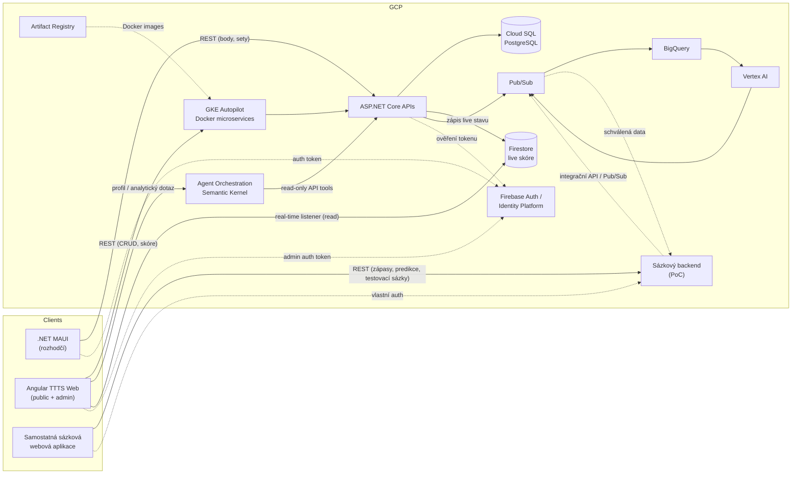

# TTTS – Tech Stack (draft v0.7)

> Status: DRAFT — návrh k diskuzi, zatím nic neimplementujeme.

## 1. Přehled komponent

| Komponenta | Technologie |
|---|---|
| Divácký web (frontend) | Angular (SPA) |
| TTTS web (frontend) | Angular (SPA) — veřejná divácká část + přihlášená admin sekce |
| API Gateway / BFF | ASP.NET Core (.NET 8/9, C#) |
| Mobilní app (rozhodčí) | .NET MAUI (Android + iOS) |
| Sázková webová aplikace (PoC) | Samostatná webová SPA `[K OVĚŘENÍ: Angular nebo jiný frontend]` |
| Sázkový backend (PoC) | Samostatná ASP.NET Core služba `[K OVĚŘENÍ]` |
| Relační data | Cloud SQL for PostgreSQL; logicky oddělené databáze/schémata podle služby `[K OVĚŘENÍ]` |
| Live skóre / real-time vrstva | Firestore (Google Cloud) |
| Hosting API | GKE Autopilot (Docker containers) |
| Hosting SPA | Firebase Hosting (nebo Cloud Storage + Cloud CDN) |
| Autentizace | Firebase Authentication (nebo Identity Platform) `[K OVĚŘENÍ]` |
| CI/CD | GitHub Actions + Artifact Registry; Cloud Build volitelně pro cloud buildy |
| Observabilita | Cloud Logging / Cloud Monitoring |
| Kontejnerizace | Docker |
| Orchestrace | Google Kubernetes Engine (GKE), preferovaně Autopilot `[K OVĚŘENÍ]` |
| Container registry | Artifact Registry |
| Asynchronní události | Pub/Sub |
| Analytika / ML | BigQuery + Vertex AI `[K OVĚŘENÍ]` |
| Agent orchestrace | Semantic Kernel (.NET) + konfigurovatelný model provider `[K OVĚŘENÍ: Vertex AI/Gemini nebo jiný provider]` |
| Integrace se sázkovou aplikací | Verzované API a/nebo Pub/Sub, pouze schválená data |
| Lokální orchestrace | Docker Compose; volitelně kind/k3d pro lokální Kubernetes PoC |
| Lokální GCP závislosti | Emulátory nebo lokální náhrady pro PostgreSQL, Firestore/Pub/Sub podle dostupnosti |
| Konfigurace prostředí | Kubernetes ConfigMap/Secret, Secret Manager na GCP, `.env` pouze pro local |
| IaC | Terraform `[K OVĚŘENÍ: případně OpenTofu]` |
| CI/CD autentizace | GitHub OIDC + GCP Workload Identity Federation, bez dlouhodobých JSON klíčů |
| Kubernetes deployment | Helm nebo Kustomize + GitHub Actions |
| Rozpočtové řízení | Cloud Billing budgets/alerts, quotas, labels a vypínatelné namespace/workloady |

## 2. Proč tato kombinace

- **.NET/C#** jednotně pro backend (Web API) i mobil (MAUI) — sdílené DTO/modely, jedna jazyková platforma napříč týmem, jak jsi preferoval.
- **Angular SPA** pro web (divák i admin) komunikující s Web API přes REST/JSON.
- **Samostatná sázková aplikace** komunikuje s TTTS pouze přes integrační kontrakt. Nemá přímý přístup do Cloud SQL ani Firestore a nemůže zapisovat skóre nebo měnit turnaje.
- **GCP jako primární cloud** — snaha maximálně využít nativní managed služby.
- **Firestore pro live skóre** — účelově jiná databáze než hlavní relační úložiště, protože:
  - Firestore má vestavěné real-time listenery (SDK pro web i mobil) — ideální pro "bod po bodu" přenos bez nutnosti vlastní SignalR/WebSocket infrastruktury.
  - Relační/administrativní data (turnaje, hráči, historie, archiv) zůstávají v Cloud SQL (Postgres) — silná konzistence, SQL dotazy, reporty, archiv.
  - **Hybridní model**: Cloud SQL = zdroj pravdy pro strukturu turnaje a finální výsledky; Firestore = efemérní/rychlá vrstva pro live stav rozehraného zápasu (aktuální skóre, podání, historie bodů v běžícím zápase). Po skončení zápasu se finální výsledek zapíše i do Cloud SQL (archiv).
- **Analytický model**: dokončené zápasy a schválené události se přes Pub/Sub/ETL propisují do BigQuery, odkud Analytics Service připravuje statistiky a Vertex AI predikce.
- **Sázkový model**: sázková aplikace si spravuje vlastní uživatele, testovací sázky a jejich stav. Z TTTS pouze čte publikované zápasy, predikce a schválené statistiky.
- **Distribuovaný model**: každá doménová služba má vlastní lifecycle, Docker image, Kubernetes deployment, API kontrakt a vlastnictví dat. V PoC může více služeb běžet nad jednou Cloud SQL instancí, ale nesmí sdílet tabulky bez jasného vlastníka; později je lze přesunout do samostatných databází.
- **Prostředí**: local, test, staging a production jsou oddělené deploymenty a datové prostory. Na GCP doporučujeme minimálně samostatné projekty `ttts-test`, `ttts-staging` a `ttts-prod`; local běží mimo GCP přes Docker Compose.
- **Lokální vývoj**: Docker Compose spouští všechny PoC mikroservisy, databáze, message broker, analytickou službu, agent orchestration a sázkový backend. Pro ověření Kubernetes manifestů lze stejný systém nasadit do kind/k3d.
- **Data se seedují**: seed runner nebo CLI vytvoří předvídatelné organizace, hráče, turnaje, zápasy, výsledky, statistiky a predikce. Seed je verzovaný, opakovatelný a podporuje reset.
- **GitHub Actions + GCP**: pull request spustí build, testy, security scan, Docker build a validaci manifestů. Merge do `main` publikuje immutable images do Artifact Registry a nasadí test. Staging a production používají chráněné GitHub Environments s approval.
- **Bezpečná autentizace CI/CD**: GitHub Actions se do GCP přihlašuje přes OIDC/Workload Identity Federation s minimálními rolemi. Service-account JSON klíče se neukládají do repozitáře ani do GitHub Secrets.
- **Infrastructure as Code**: Terraform spravuje GCP projekty nebo jejich sdílené resources, registry, GKE, IAM, Pub/Sub, Firestore a billing/labels. Kubernetes konfigurace je v repozitáři a nasazuje se přes Helm/Kustomize.
- **Low-cost PoC**: lokální Compose je primární vývojový režim. Artifact Registry, Cloud Storage/Firebase Hosting, Firestore a Pub/Sub lze využívat v rámci kvót, ale GKE Autopilot a Cloud SQL nejsou automaticky bezplatné. GKE/Cloud SQL/BigQuery/Vertex AI se proto zapínají jen v cloudovém demonstračním profilu a musí mít rozpočtové alerty.

`[ROZHODNUTO]`: Zápis dat jde **vždy přes Web API** (varianta B) — API validuje business logiku (platnost bodu, konec setu/zápasu, oprávnění) a zapisuje jak do Cloud SQL, tak do Firestore. Klienti (MAUI, Angular) **nikdy nezapisují přímo do Firestore** — pouze se odebírají (real-time listener) na živá data pro čtení. To zjednodušuje Firestore Security Rules (jen read pro klienty, write pouze přes server/service account) a drží veškerou validaci na jednom místě.

## 3. Architektura na vysoké úrovni

Platforma je **multi-tenant** — libovolný počet turnajů běží nezávisle a souběžně; GKE Autopilot škáluje jednotlivé Docker kontejnery podle zátěže a Firestore přirozeně zvládá mnoho souběžných dokumentů/listenerů (klíčované podle `tournamentId`/`matchId`).

Kvůli požadavku na distribuovaný systém budou služby baleny jako samostatné Docker images a provozovány na GKE. Každá služba má vlastní Kubernetes Deployment, Service, ConfigMap/Secret, readiness/liveness probe, resource limits a horizontální škálování podle potřeby. Doporučené první rozdělení je:

- **API Gateway/BFF** — veřejný vstupní bod, směrování, rate limiting a sjednocení klientských API; neobsahuje doménovou business logiku.
- **Identity/Organization Service** — uživatelé, organizace, členství, role a tenant context.
- **Player Service** — profily hráčů, registrace, deaktivace/anonymizace a historie identity.
- **Tournament Service** — turnaje, startovní listiny, skupiny, pavouky a pravidla postupu; vlastní turnajová data.
- **Archive Service/Module** — uzavření turnaje, neměnné projekce konečného pořadí a historického výsledku; v PoC může být součástí Tournament Service, ale má oddělený kontrakt pro čtení archivu.
- **Match/Scoring Service** — zápasy, validace bodů, setů a zápasů; vlastní oficiální výsledky.
- **Live Score Service** — projekce aktuálního skóre do Firestore a real-time distribuce klientům.
- **Analytics Service** — čtecí modely statistik hráčů, historie vzájemných zápasů, forma, feature data a predikce přes Vertex AI; data lze znovu sestavit z archivu.
- **Agent Orchestration Service** — experimentální multi-agentní workflow se Semantic Kernel; pouze read-only nástroje nad Player, Archive a Analytics API.
- **Integration Service** — verzované exportní API a Pub/Sub události pro schválené externí odběratele.
- **Betting Service (samostatný projekt)** — vlastní uživatelé a testovací sázky; není součástí doménového jádra TTTS.

### 2.1 Model prostředí

| Prostředí | Runtime | Data | Účel |
|---|---|---|---|
| Local | Docker Compose, volitelně kind/k3d | lokální PostgreSQL, Firestore/Pub/Sub emulator nebo náhrada | vývoj a ruční ověřování celého PoC |
| Test | GKE namespace nebo samostatný test cluster | resetovatelná seed data | unit, integrační, kontraktační a automatizované E2E testy |
| Staging | GKE | realistická anonymizovaná/seed data | release kandidát, migrace, performance a E2E ověření |
| Production | GKE | skutečná data | ostrý provoz |

Každé prostředí má vlastní hodnoty konfigurace, secrets, databázové migrace, Pub/Sub topics, Firestore namespace a observability dashboardy. Docker image se sestavuje jednou a následně se propaguje mezi prostředími.

### 2.2 CI/CD pipeline

Vývojářský a nasazovací tok pro PoC:

1. **Lokální změna** — vývojář vytvoří feature branch, například `feature/player-statistics`, a pracuje proti lokálnímu Docker Compose prostředí.
2. **Lokální kontrola** — Git hooky spouštěné přes Husky nebo `pre-commit` kontrolují formátování, lint a rychlé unit testy. Před push může proběhnout build dotčené služby a integrační testy.
3. **Commit a push** — commit používá dohodnutý formát, například Conventional Commits, a branch se publikuje do GitHubu.
4. **Pull Request do `main`** — přímý push do `main` není standardně povolený. PR vyžaduje úspěšné checks a code review; pro PoC se používá squash merge.
5. **CI na Pull Requestu** — GitHub Actions provede restore závislostí, format check, lint, unit testy, integrační testy, contract testy, build dotčených služeb, Docker build, vulnerability scan a validaci Terraform/Helm/Kustomize.
6. **Lokální E2E v CI** — workflow spustí Docker Compose se seed scénářem a Playwright nebo obdobný nástroj ověří hlavní uživatelské workflow. E2E běh nesmí používat produkční data.
7. **Merge do `main`** — GitHub Actions z čistého commitu sestaví Docker images pouze jednou, označí je immutable tagem podle `git-sha` a pushne je do Artifact Registry.
8. **Deployment do testu** — CI se přihlásí do GCP přes GitHub OIDC/Workload Identity Federation, nasadí konkrétní image digest přes Helm/Kustomize, provede migrace, seed testovacích dat, readiness checks a cloudové smoke/E2E testy.
9. **Promotion do stagingu** — po schválení se nepřebuildí nový image; použije se stejný image digest, který prošel testem. Spustí se migrace, deployment, smoke/E2E testy a případně performance test.
10. **Promotion do production** — chráněné GitHub Environment vyžaduje explicitní approval. Nasadí se pouze image digest schválený ve stagingu, s produkční konfigurací, secrets, readiness/liveness kontrolou a smoke testem.
11. **Rollback** — deployment se vrátí na předchozí image digest a deklarovanou konfiguraci. Běžící kontejnery se neupravují ručně.

CI v Pull Requestu provádí validace bez deploymentu do produkce. Production identity je oddělená od testovací a není dostupná z Pull Request workflow.

### 2.3 GitHub Actions workflow

Doporučené workflow soubory:

- `ci.yml` — PR checks: format, lint, unit/integration/contract tests, build, Docker scan a validace IaC.
- `build-publish.yml` — po merge do `main`: build image, push do Artifact Registry a uložení image digestu jako výstupu.
- `deploy-test.yml` — deployment do testu, migrace, seed a cloudové E2E.
- `promote.yml` — ruční promotion stejného digestu do stagingu nebo production přes GitHub Environments.
- `rollback.yml` — řízený návrat na předchozí image digest.

GitHub Actions používá oddělené identity a minimální IAM role pro test, staging a production. Autentizace do GCP probíhá přes OIDC/Workload Identity Federation; service-account JSON klíče se neukládají do repozitáře ani do GitHub Secrets.

Lokální vývoj a PR checks používají Docker Compose. GKE deployment se spouští až pro testovací cloudové prostředí a následné promotion, aby PoC zbytečně nespotřebovával GCP prostředky.

Deploymenty a resources jsou označené environmentem, cost centrem a vlastníkem kvůli billing reportům.

### 2.4 Seed scénáře

Seed data jsou samostatná verzovaná komponenta, například `SeedRunner` nebo CLI. Musí umět:

- vytvořit několik organizací a registrovaných hráčů s profily,
- vytvořit historické dokončené turnaje a vzájemné zápasy,
- vytvořit právě probíhající turnaj s rozlosováním, stoly a živým skóre,
- vytvořit výsledky vhodné pro Analytics/ML a Semantic Kernel agenty,
- naplnit testovací predikce a data pro sázkový PoC,
- provést idempotentní seed, reset a případně seed konkrétního scénáře.

Seed účty a testovací secrets nesmí být použity v produkci. Produkce používá pouze explicitní migrační a importní proces s auditní stopou.

Služby komunikují synchronně přes interní REST/gRPC rozhraní jen tam, kde je potřeba okamžitá odpověď; uzavření turnaje a dokončení zápasů publikují přes Pub/Sub. Analytics, Agent Orchestration, Integration a Betting Service proto nejsou v kritické cestě zápisu bodu. Přímé sdílení databází mezi službami není dovoleno. Profil hráče a analytické přehledy čtou z optimalizovaných projekcí Analytics Service, nikoliv přímým dotazem do databáze Match/Scoring Service.

### 3.2 Multi-agentní PoC

Agent Orchestration Service běží jako samostatný Kubernetes deployment. Semantic Kernel v ní funguje jako orchestrace a plugin/tool vrstva, nikoliv jako náhrada doménových služeb. Agenti používají pouze interní read-only API:

- Orchestrator Agent směruje uživatelský dotaz a řídí workflow.
- Player History Agent čte archiv hráče a jeho účasti.
- Head-to-Head Agent čte vzájemné zápasy dvou hráčů.
- Statistics Agent pracuje s agregovanými statistikami a formou.
- Prediction Agent načítá výstup Analytics/ML Service.
- Explanation Agent sestaví odpověď s odkazy na použité zdroje a uvedením nejistoty.

Semantic Kernel plugins nesmí obsahovat přímé databázové přístupy ani mutační nástroje pro scoring, turnaje, hráče nebo sázky. Každé volání pluginu prochází autorizací, limity a auditním logem. V případě nedostupnosti agentní služby musí hlavní TTTS workflow pokračovat bez ní.

### 3.1 PoC datový tok

1. Rozhodčí nebo admin zapíše bod přes TTTS API.
2. Scoring Service validuje změnu, uloží live stav a po dokončení zápasu zapíše oficiální výsledek.
3. Událost o dokončeném zápase se publikuje do Pub/Sub a analytická pipeline ji zpracuje v BigQuery.
4. Analytics Service aktualizuje statistiky a případně vytvoří predikci dalšího zápasu ve Vertex AI.
5. Integration Service zveřejní pouze schválená data sázkovému backendu.
6. Sázkový web zobrazí zápasy a predikce přihlášenému uživateli a v PoC umožní vytvořit testovací sázku ve vlastním systému.

## 4. Otevřené otázky k tech stacku

1. Jeden Angular projekt pro divácký + admin web, nebo dva samostatné SPA?
2. ~~Firestore Security Rules pouze pro čtení klientům, zápis jen přes API~~ — **rozhodnuto, viz sekce 2**.
3. Autentizace: preferováno **co nejjednodušší řešení** — kandidáti Firebase Auth (nejjednodušší integrace s GCP/Firestore) vs. vlastní JWT v API. Rozhodnutí odloženo, doporučuji Firebase Auth jako výchozí volbu pro jednoduchost.
4. Nasazení mobilní app: bude appka v App Store / Google Play, nebo interní distribuce (ad-hoc/TestFlight/Play Internal Testing)?
5. Prostředí: potřeba dev/staging/prod na GCP, nebo zatím jen jeden projekt?
6. Datový model pro multi-tenant Firestore: kolekce/dokumenty klíčované podle `tournamentId` (a `matchId` pro live stav) — potvrdit strukturu při návrhu datového modelu.
7. GKE Autopilot vs. Cloud Run pro jednotlivé služby; požadavek na Kubernetes favorizuje GKE, ale je potřeba zohlednit provozní náklady a složitost.
8. Kontrakt integračních událostí a API pro externí projekt: verze, autentizace, limity, anonymizace a dostupná granularita dat.
9. BigQuery/Vertex AI pipeline: frekvence přepočtu statistik, minimální množství dat pro predikce a způsob evidence verze modelu.
10. Bude sázkový PoC pouze simulovat sázky bez peněz, nebo bude mít i testovací zůstatek/virtuální měnu?
11. Jaký model provider bude použit pro Semantic Kernel a jak budou řešeny limity tokenů, náklady a ukládání promptů/odpovědí?
12. Budou test a staging provozované v jednom GKE clusteru v oddělených namespacech, nebo ve vlastních clusterech/projektech?
13. Které GCP služby budeme lokálně emulovat a které nahradíme lokální komponentou (např. Pub/Sub emulátor vs. RabbitMQ/Redis)?
11. Jaké přesné predikce budou v první verzi (vítěz zápasu, výsledek 3:0/3:1/3:2, počet setů nebo jiné)?
